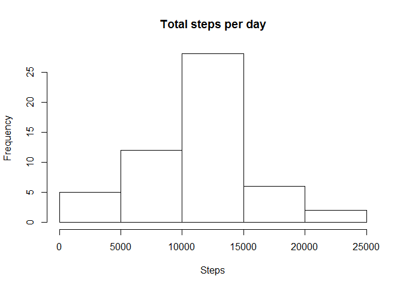
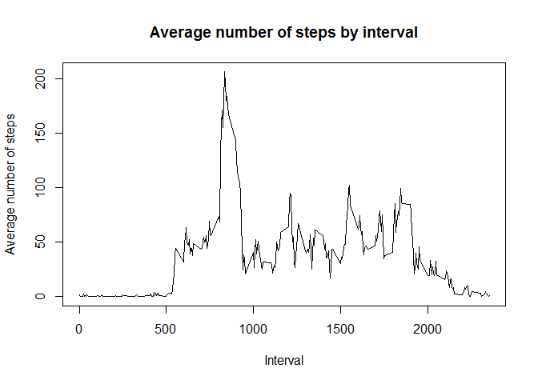
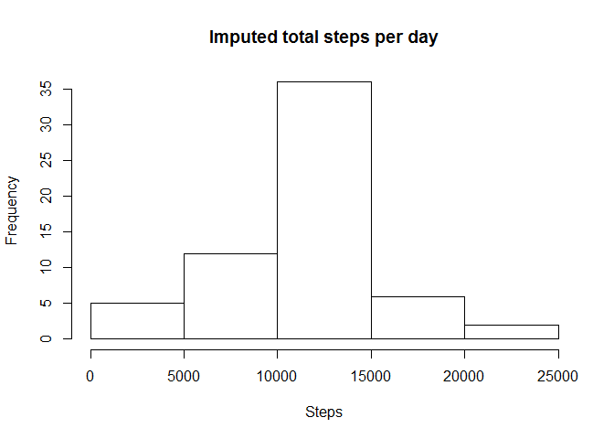
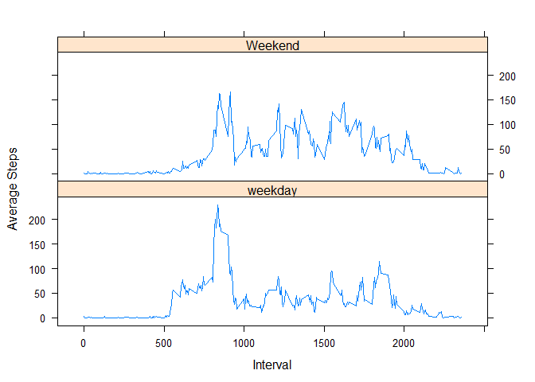

# Reproducible Research: Peer Assessment 1
RH  
October 19, 2016  

## Loading and preprocessing the data
Unzip and read the data file into dataframe 'data'

```r
  unzip("activity.zip")
  data <- read.csv("activity.csv")
```

## What is mean total number of steps taken per day?
Calculate the total number of steps taken per day and make 

```r
  daily_average <- aggregate(steps ~ date,data = data, FUN = sum)
```

Make a histogram of the total number of steps taken each day

```r
  hist(daily_average$steps, main = "Total steps per day", xlab = "Steps")
```

<!-- -->

Calculate and report the mean and median of the total number of steps taken per day

```r
  steps_mean <- mean(daily_average$steps)
  steps_median <- median(daily_average$steps, na.rm = TRUE)
```

The mean of the total number of steps taken per day is 1.0766189\times 10^{4} and the median is 10765.

## What is the average daily activity pattern?
Make a time series plot (i.e. type = "l") of the 5-minute interval (x-axis) and the average number of steps taken, averaged across all days (y-axis)

```r
  steps_interval <- aggregate(steps ~ interval, data = data, FUN = mean)
  plot(steps_interval$interval, steps_interval$steps, type = "l", main = "Average number of steps by interval", xlab = "Interval", ylab ="Average number of steps")
```

<!-- -->

Calculate Which 5-minute interval, on average across all the days in the dataset, contains the maximum number of steps?

```r
  steps_interval_max <- steps_interval[steps_interval$steps==max(steps_interval$steps), 1]
```

The 5-minute interval of 835 contains the maximum number of steps.

## Imputing missing values
calculate missing values

```r
  missing_rows <- sum(is.na(data$steps))
```
2304 rows have missing values.

Impute the missing values by substitute the missing values with corresponding interval average with rounding


```r
  data_imputed <- data
  for(i in 1:nrow(data_imputed)){
    if(is.na(data_imputed[i, ]$steps)){
      data_imputed[i, ]$steps <- as.integer(round(steps_interval[steps_interval$interval == data_imputed[i, ]$interval, 2]))
    }
  }
```

Create histgram of imputed data

```r
  daily_average_imputed <- aggregate(steps ~ date,data = data_imputed, FUN = sum)
  hist(daily_average_imputed$steps, main = "Imputed total steps per day", xlab = "Steps")
```

<!-- -->

Calculate and report the mean and median of the imputedtotal number of steps taken per day

```r
  steps_mean_imputed <- mean(daily_average_imputed$steps)
  steps_median_imputed <- median(daily_average_imputed$steps)
```

The mean of the imputed total number of steps taken per day is 1.0765639\times 10^{4} and the median is 10762.

Comparison of mean of median between original and imputed data

Comparison | Original |Imputed
------ | ---------------- | ------------------------
Mean  | 1.0766189\times 10^{4} | 1.0765639\times 10^{4}
Median| 10765 | 10762  

## Are there differences in activity patterns between weekdays and weekends?

Create a categorical variable of weekend or weekday based on date.

```r
  data_imputed$weekdays <- ifelse(weekdays(as.Date(data_imputed$date)) %in% c("Saturday", "Sunday"), "Weekend", "weekday")
```

Make a panel plot containing a time series plot (i.e. type = "l") of the 5-minute interval (x-axis) and the average number of steps taken, averaged across all weekday days or weekend days (y-axis).

```r
  data_imputed_interval_weekday <- aggregate(steps ~ interval + weekdays, data = data_imputed, FUN = mean)
  library(lattice)
```

```
## Warning: package 'lattice' was built under R version 3.2.5
```

```r
  xyplot(steps ~ interval | weekdays, data = data_imputed_interval_weekday, Main = "Average steps by interval", xlab = "Interval", ylab = "Average Steps", type = "l", layout = c(1,2))
```

<!-- -->
